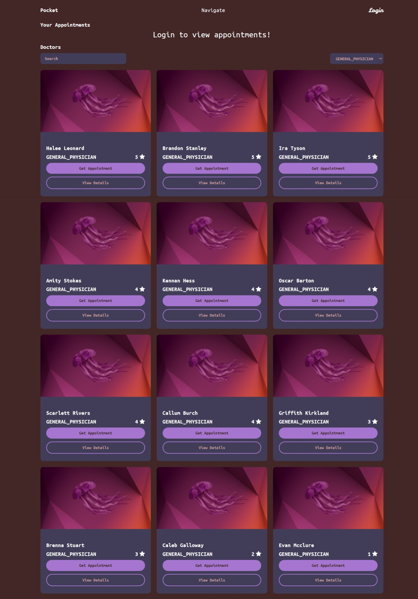
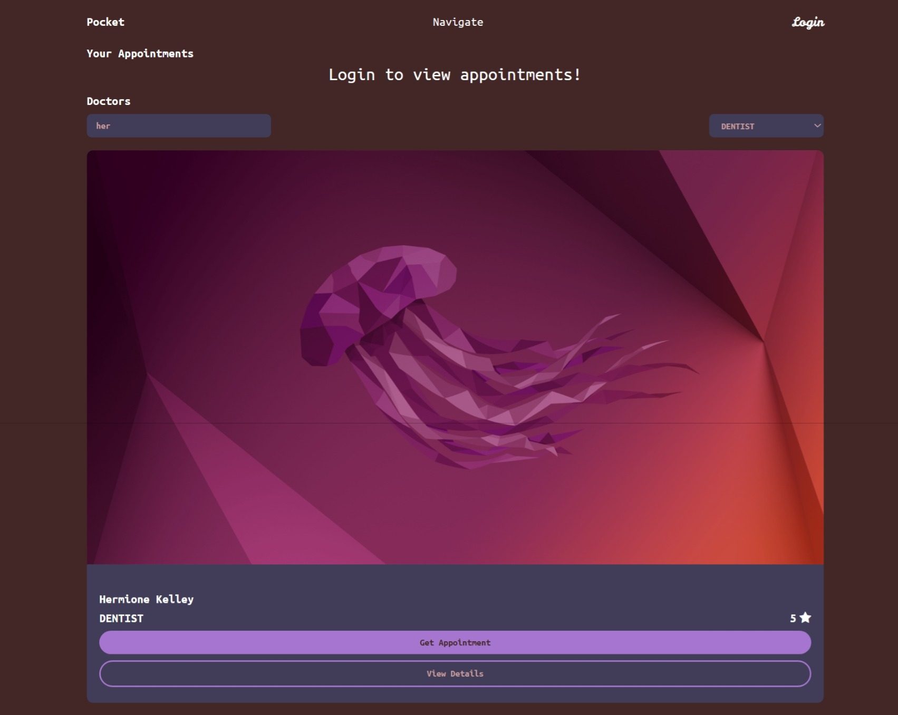
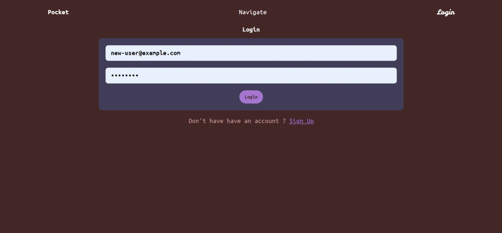
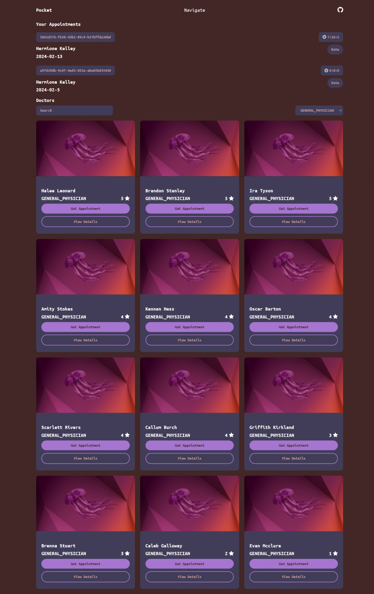
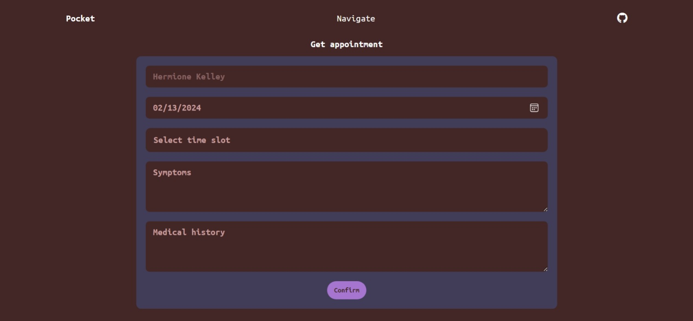

### Pocket Application

Project based on **React.js** & **Typescript**, it lets users to consult with the doctors available.

### Pre Requisites

- **Node.js** version **21** or greater.

### Dependencies used by the project

1. **react**.
2. **react-router**.
3. **redux**.
4. **bootstrap**.
5. **font-awesome**.
6. **classnames**.

### Dev Dependencies used by the project

1. **vite**.
2. **sass**.
3. **autoprefixer**.
4. **post-css**.
5. **eslint**.

### Required environment variables

1. `VITE_BASE_URL` specify the Firebase Realtime Database URL in `.env`.
1. `VITE_SESSION_TIMOUT` specify the time until the user can be logged in, in `.env`.

### Instructions

1. Visit `http://localhost:3000/`, this will open the home page that looks like this. 

2. Filter the doctors either by typing the name or selecting the specific category. 

3. Click on login to login to your account or you can create your account if you don't have. 

4. By logging in you can view all of your appointments on the home page. 

5. Click on `Get Appointment` button for getting an appointment with the specific doctor. 
