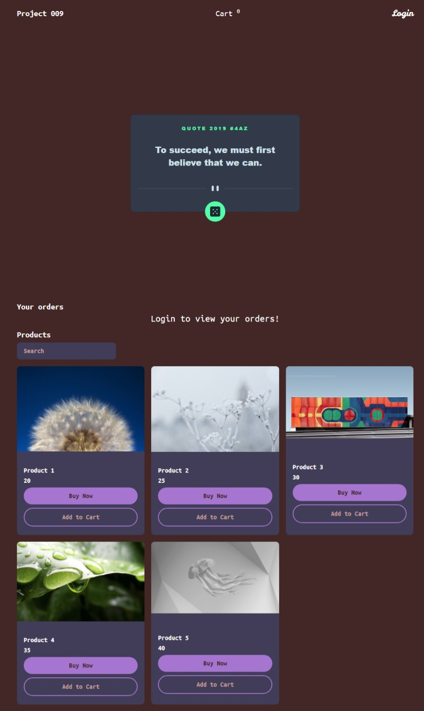
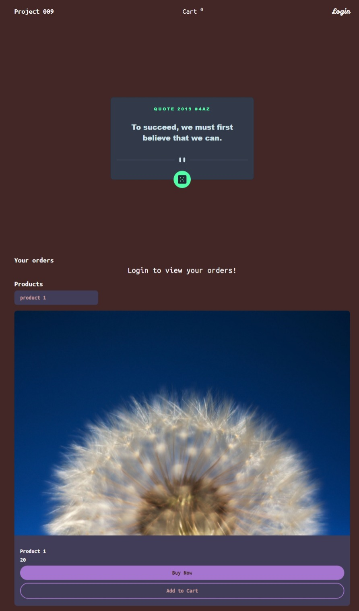
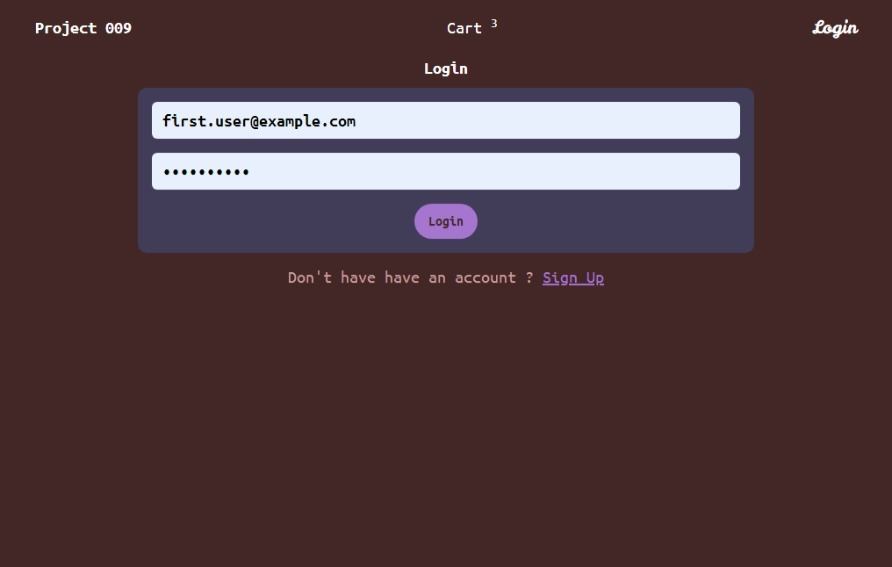
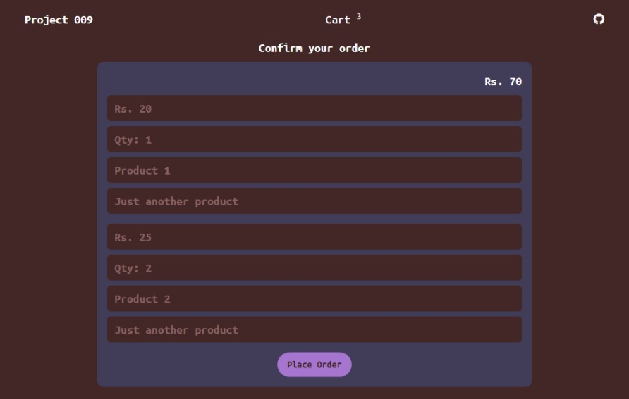
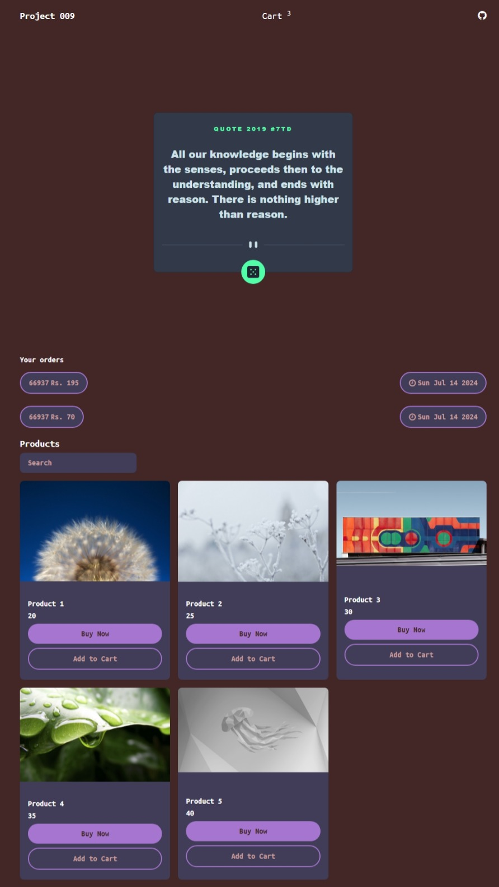

### Project 009

Project based on **React.js** & **Typescript**, just a simple react application.

### Pre Requisites

- **Node.js** version **21** or greater.

### Dependencies used by the project

1. **react**.
2. **redux**.
3. **axios**.
4. **bootstrap**.
5. **react-router**.
6. **font-awesome**.

### Dev Dependencies used by the project

1. **vite**.
2. **sass**.
3. **eslint**.
4. **post-css**.
5. **autoprefixer**.

### Required environment variables

1. `VITE_BASE_URL` specify the Firebase Realtime Database URL in `.env`.

2. `VITE_SESSION_TIMOUT` specify the time until the user can be logged in, in `.env`, refer `.env.example`.

### Instructions

1. Visit `http://localhost:3000/`, this will open the home page that looks like this.    

2. Filter the products by typing the name.    

3. Click on login to login to your account or you can create your account if you don't have.    

4. By logging in you can view all of your previous orders on the home page.    

5. Click on `Add to cart` or `Buy Now` button for adding and buying the product.    
