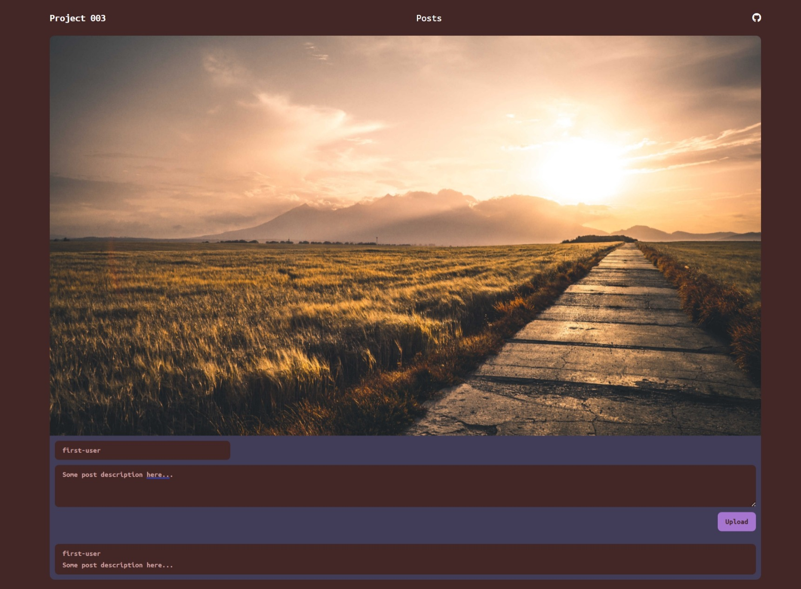

### Social

Project based on **Next.js**, it provides an interface for the user to upload images.

### Pre Requisites

- **Node.js** version **21** or greater.
- **MongoDB** must be installed and databaseURL must be set in the .env file.

### Dependencies used by the project

1.  **mongodb**.
2.  **express**.
3.  **mongoose**.
4.  **reduxjs/toolkit**.
5.  **bootstrap**.
6.  **express**.
7.  **mongodb**.
8.  **mongoose**.
9.  **font-awesome**.
10. **next**.
11. **react**.
12. **react-dom**.
13. **react-redux**.
14. **socket.io**.
15. **socket.io-client**.

### Dev Dependencies used by the project

1. **env-cmd**
2. **autoprefixer**
3. **nodemon**
4. **postcss**
5. **sass**

### Available scripts

1. `npm run dev` for running the application in local environment.

### Required environment variables

1. `databaseURL` specify the database URL to connect to database `./config`.

### Instructions

Here are some screen shots of the application.

1. Initial Page.    

2. Adding a post.    

3. Post updated.    

4. Commenting a post.    

5. Comment added.    

6. Comment count updated.    
